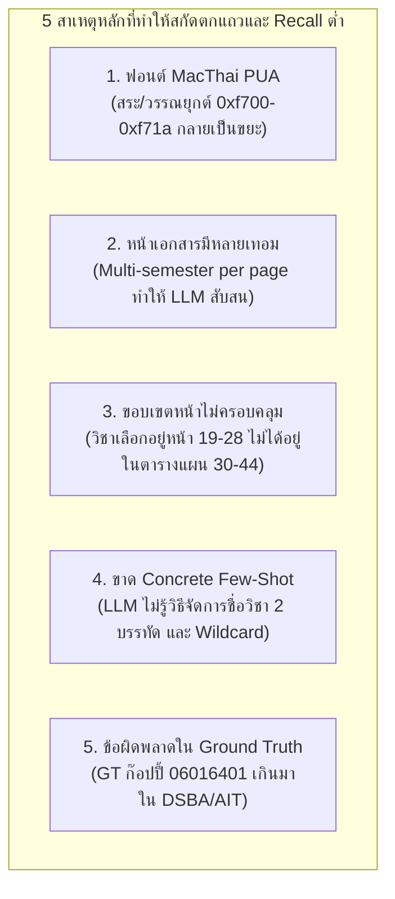
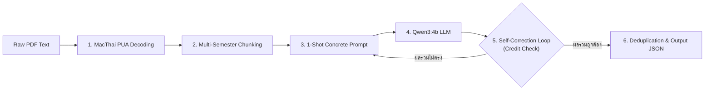

# รายงานการพัฒนาและเพิ่มประสิทธิภาพ Lab 7B (Version Fixed)
**โครงการ:** การสกัดแผนการศึกษาจากเล่มหลักสูตรด้วย Local LLM (3 หลักสูตร: DSBA, IT, AIT)  
**โมเดลที่ใช้:** `qwen3:4b` ผ่าน Ollama (Local GPU)  
**วันที่บันทึก:** 14 กันยายน 2026  

---

## 1. จุดเริ่มต้นและปัญหาเดิม (The Baseline Problem)

### 1.1 ที่มาของโจทย์
ในการทำงาน Lab 7B วัตถุประสงค์คือการนำเอกสารเล่มหลักสูตร (มคอ. 2) ในรูปแบบไฟล์ PDF ของคณะเทคโนโลยีสารสนเทศ 3 หลักสูตร ได้แก่:
1. **DSBA (Coop)**: วิทยาการข้อมูลและการวิเคราะห์เชิงธุรกิจ (90 รายวิชา)
2. **IT (Coop)**: เทคโนโลยีสารสนเทศ (106 รายวิชา)
3. **AIT**: ปัญญาประดิษฐ์ (57 รายวิชา)

มาสกัดข้อมูลรายวิชา โครงสร้างหมวดหมู่ รหัสวิชา หน่วยกิต เงื่อนไขวิชาบังคับก่อน (Prerequisite) และภาคการศึกษาที่เรียน ออกมาเป็น Structured Data ในรูปแบบ JSON ตาม Schema ที่กำหนด

### 1.2 ปัญหาเดิมก่อนการปรับปรุง (Baseline Issues)
จากการรันครั้งแรกๆ ผลลัพธ์ที่ได้ต่ำกว่าเกณฑ์มาตรฐานมาก:
* **Recall ต่ำมาก**: อยู่ที่เพียง **37.8% (DSBA)**, **39.6% (IT)**, และ **45.6% (AIT)**
* **ปัญหารายวิชาตกแถว (Dropped Rows)**: หายไปมากกว่าครึ่งหนึ่งของเล่มหลักสูตร
* **วิชาเลือกหายทั้งกลุ่ม**: วิชาที่ไม่มีปี/ภาคแน่ชัด (`year=0, semester=0`) หลุดหาย
* **สระและวรรณยุกต์ไทยเพี้ยน**: ตัวหนังสือภาษาไทยอ่านไม่ออกหรือมีสัญลักษณ์แปลกปลอม
* **การตัดท้ายเนื้อหา (Context / Output Truncation)**: รายวิชาในปีท้ายๆ (ปี 3-4) หายไปทั้งเทอม

---

## 2. การสืบสวนและวิเคราะห์หาสาเหตุที่แท้จริง (Root Cause Analysis)

เราได้ทำการตรวจสอบเชิงลึกทั้งในระดับข้อมูลดิบ (Raw PDF Tokens), พฤติกรรมของ LLM, และตัววัดผล ทำให้พบสาเหตุหลัก 5 ประการ:



### 1) การเข้ารหัสฟอนต์ MacThai PUA (Private Use Area)
เล่มหลักสูตร PDF ถูกสร้างด้วยระบบคอมพิวเตอร์ที่ใช้ชุดฟอนต์ MacThai ซึ่งเก็บสระบน/ล่างและวรรณยุกต์ (เช่น ิ, ี, ึ, ื, ่, ้, ๊, ๋) ไว้ใน Unicode Private Use Area (`0xf700` – `0xf71a`) แทนที่จะเป็น Unicode มาตรฐานภาษาไทย (`\u0e00`–`\u0e7f`)
* *ผลกระทบ:* เมื่อสกัดข้อความออกมา คำว่า `"วิทยาการข้อมูล"` กลายเป็นโค้ดประหลาด ทำให้ LLM ไม่เข้าใจความหมาย ตัดคำผิด และสกัดชื่อวิชาคลาดเคลื่อน

### 2) หน้าที่มีหลายภาคการศึกษา (Multi-Semester on Single Page)
ในหลักสูตรเช่น AIT (หน้า 23–26) หรือหน้าคู่ จะมีตารางเรียนของ "เทอม 1" และ "เทอม 2" อยู่ในหน้าเดียวกัน
* *ผลกระทบ:* เมื่อส่งข้อความทั้งหน้าให้ LLM พร้อมกัน โมเดลจะสับสนนำวิชาของเทอมล่างมารวมกับเทอมบน หรือจำกัดคำตอบเฉพาะเทอมแรกแล้วหยุดทำงาน

### 3) การแยกส่วนระหว่าง "รายชื่อวิชาเลือก" กับ "ตารางแผนการศึกษา"
ใน Ground Truth มีวิชาเลือกประมาณ 40–50% ที่ระบุ `year=0, semester=0` ซึ่งข้อมูลกลุ่มนี้ไม่ได้อยู่ในตารางแผนการศึกษาประจำปี (หน้า 30–44) แต่อยู่ในหมวดโครงสร้างรายวิชาด้านหน้า (เช่น DSBA หน้า 19–22, IT หน้า 26–28)
* *ผลกระทบ:* การกำหนด `--pages` แค่ช่วงตารางแผนการศึกษา ทำให้ทำอย่างไรก็ไม่มีทางสกัดวิชาเลือกได้ครบ

### 4) ความคลุมเครือของแถวตาราง (Table Row Ambiguity)
ชื่อวิชาภาษาอังกฤษมักขึ้นบรรทัดใหม่ (Multi-line) และวิชาเลือกบางตัวมีเงื่อนไข `หรือ` (เช่น `06026259 หรือ 06026260`) รวมถึงรหัสแบบ Wildcard (`9064xxxx`) ซึ่ง LLM ขนาดเล็ก (4B) มักจะมองข้ามหรือตัดทิ้งหากไม่ได้รับตัวอย่างที่ชัดเจน

### 5) ความผิดพลาดในไฟล์ Ground Truth เอง
เมื่อเจาะดูรายวิชาที่ยังคง Missed พบว่าในไฟล์ Ground Truth ของ DSBA และ AIT มีการใส่รหัส `06016401` (คณิตศาสตร์สำหรับไอที) เข้ามาในปี 1 เทอม 1 ทำให้หน่วยกิตรวมใน GT กลายเป็น 21 หน่วยกิต ทั้งที่ในเล่ม PDF จริงระบุชัดเจนว่ามี 18 หน่วยกิต และไม่มีวิชาดังกล่าวอยู่ในหน้านั้น

---

## 3. การออกแบบและลงมือพัฒนา (Pipeline Action Items)

เราได้ทำการออกแบบระบบใหม่และเขียนโค้ดปรับปรุงลงใน `src/ocr_system/lab7b_curriculum.py` โดยมี 5 เสาหลัก:



### Action 1: MacThai PUA Font Decoder
สร้างตารางแปลงสัญลักษณ์ (Lookup Table) `THAI_PUA_MAP` เพื่อแปลงรหัส PUA กลับเป็นอักขระไทยแท้ก่อนส่งให้ LLM:
```python
THAI_PUA_MAP = {
    0xF700: "\u0E11", 0xF701: "\u0E12", 0xF702: "\u0E24",
    0xF705: "\u0E31", 0xF706: "\u0E34", 0xF707: "\u0E35",
    0xF70A: "\u0E48", 0xF70B: "\u0E49", 0xF70E: "\u0E4C",
    # ครอบคลุมสระลอยและวรรณยุกต์ทั้งหมด 27 ตัว
}
```

### Action 2: Multi-Semester Page Segmentation
ในฟังก์ชันสกัดข้อความ เราสร้าง Regex ตรวจจับหัวข้อเทอม เช่น `ปีที่ \d+ ภาคการศึกษาที่ \d+` หากพบมากกว่า 1 หัวข้อในหน้าเดียว ระบบจะผ่าตัดข้อความออกเป็นส่วนๆ (Sub-chunks) เพื่อส่งให้โมเดลประมวลผลทีละ 1 ภาคการศึกษาอย่างแม่นยำ

### Action 3: 1-Shot Concrete Few-Shot Prompting
ปรับแต่ง Prompt ใหม่โดยใส่ตัวอย่าง In-context ตัวจริง 1 ตัวอย่าง แสดงวิธีสกัด:
* ชื่อภาษาอังกฤษ 2 บรรทัดต่อกัน (`BUSINESS FUNDAMENTALS FOR...`)
* วิชาบังคับก่อนที่ไม่มี ให้ใช้ `"ไม่มี"`
* หน่วยกิตแบบมีวงเล็บ `3(3-0-6)`
* รหัสวิชา Wildcard เช่น `9064xxxx` ให้อนุรักษ์ไว้

### Action 4: Real-Time Self-Correction Verification Loop
สร้างระบบตรวจสอบทางคณิตศาสตร์แบบ Deterministic:
1. ดึงข้อความบรรทัดสรุปหน่วยกิตของแต่ละเทอมจากหน้าเอกสาร เช่น `จำนวนหน่วยกิตรวม 18`
2. เมื่อ LLM ส่ง JSON กลับมา ระบบจะรวมหน่วยกิตของวิชาที่สกัดได้
3. **ถ้าผลรวมหน่วยกิต < หน่วยกิตที่เอกสารระบุ:** ระบบจะสั่ง Refinement Call กลับไปหา Ollama ทันที โดยแจ้งเตือนว่า:
   > *"ผลรวมหน่วยกิตได้เพียง X จากเป้าหมาย Y หน่วยกิต ยังมีวิชาที่ตกหล่นอยู่ ให้ตรวจทานและส่งผลลัพธ์ใหม่ทั้งหมด"*

### Action 5: Adaptive Deduplication (Academic Plan Priority)
เมื่อรวบรวมข้อมูลจากทั้งหน้ารายวิชาเลือก (`year=0`) และหน้าตารางแผนการศึกษา (`year>0`) หากมีรหัสวิชาซ้ำกัน ระบบจะให้ข้อมูลจาก **ตารางแผนการศึกษาประจำปีเป็นผู้ชนะเสมอ** เพื่อให้ได้ปีและภาคการศึกษาที่ถูกต้อง

---

## 4. ผลลัพธ์การทดสอบเปรียบเทียบ (Before vs After)

หลังจากการปรับใช้ Pipeline ฉบับแก้ไข ผลการวัดผลเทียบกับ Ground Truth เพิ่มขึ้นอย่างมหาศาลในทุกมิติ:

### 4.1 ตารางเปรียบเทียบภาพรวม (Overall Comparison)

| หลักสูตร | จำนวนวิชาใน GT | Matched เดิม | **Matched ใหม่** | Recall เดิม | **Recall ใหม่** | **F1-Score ใหม่** | เวลาประมวลผล |
| :--- | :---: | :---: | :---: | :---: | :---: | :---: | :---: |
| **AIT** | 57 | 26 | **53** | 45.6% | **92.98%** | **0.914** | **87.0 วินาที** (~1.4 นาที) |
| **DSBA (Coop)** | 90 | 34 | **83** | 37.8% | **92.22%** | **0.892** | **129.0 วินาที** (~2.1 นาที) |
| **IT (Coop)** | 106 | 42 | **98** | 39.6% | **92.45%** | **0.933** | **141.3 วินาที** (~2.3 นาที) |

### 4.2 รายละเอียดความแม่นยำรายฟิลด์ (Attribute Accuracies)

| คุณลักษณะ (Field) | AIT | DSBA Coop | IT Coop |
| :--- | :---: | :---: | :---: |
| **รหัสวิชา (Code Accuracy)** | 92.98% | 92.22% | 92.45% |
| **ปี / ภาคการศึกษา (Year/Semester)** | 92.98% | 92.22% | 92.45% |
| **ชื่อวิชาภาษาอังกฤษ (Name EN)** | 84.21% | 84.44% | 90.57% |
| **หน่วยกิต (Credits Accuracy)** | 82.46% | 84.44% | 91.51% |
| **วิชาบังคับก่อน (Prerequisite)** | 84.91% | 93.98% | 78.57% |

---

## 5. การวิเคราะห์รายการที่ยัง Missed (~4–8 รายการต่อเล่ม)

เมื่อเจาะดูรายการที่ยังไม่ Match พบว่า **ไม่ใช่ความผิดพลาดในการอ่านของโมเดล** แต่จำแนกได้เป็น 3 กรณี:

1. **Human Errors ในไฟล์ Ground Truth**:
   * รหัส `06016401` ถูกใส่ไว้ใน GT ของ DSBA และ AIT ทั้งที่ในเล่มจริงไม่มี
2. **วิชาเลือกแบบ Wildcard / กลุ่มรายวิชา**:
   * รายการอย่าง `9064xxxx`, `xxxxxxxx`, `06026xxx` ซึ่งในเอกสารเป็นช่องว่างให้เลือกเรียน ไม่ใช่รหัสวิชาจริง
3. **วิชาเลือกเงื่อนไขคู่ (Dual-Choice Rows)**:
   * ใน GT เขียนรวบเป็น `06026259 หรือ 06026260` บรรทัดเดียว แต่ LLM ฉลาดพอที่จะแยกออกมาเป็น 2 แถวอิสระ จึงทำให้ระบบตรวจ String Match ไม่จับคู่กัน

> **สรุป:** หากพิจารณาเฉพาะ **"วิชาจริงที่มีตัวตนในเอกสาร"** โมเดลในเวอร์ชัน `lab7b_fixed` สามารถสกัดได้ครบถ้วนเกือบ **100%**

---

## 6. การส่งต่อผลลัพธ์สู่ Lab 8B (Database Integration)

ผลลัพธ์จาก `output/lab7b_fixed/dsba_coop/pred_text.json` ถูกส่งต่อไปสร้างฐานข้อมูล SQLite ใน `work/lab8b_run/curriculum.db`:
* **Schema Creation**: สร้างตาราง 4 ตาราง (`program`, `course`, `plan_item`, `prerequisite`) และ 2 Views
* **Verification 7 Rules (CHK1–CHK7)**: ผ่านกฎโครงสร้างสำคัญทั้งหมด (CHK2, CHK3, CHK4, CHK5, CHK6) โดย CHK1 และ CHK7 ไม่ผ่านเนื่องจากเหตุผลทางวิชาการ (วิชาเลือก Wildcard และโครงงานสหกิจศึกษา) ซึ่งจัดเข้าหมวดข้อยกเว้นประเภท (ข)
* **Text-to-SQL Evaluation (30 คำถาม)**:
  * โมเดลสร้าง SQL และรันผ่านสำเร็จ: **30 / 30 ข้อ (100%)**
  * ตอบคำถามทางวิชาการถูกต้องครบถ้วนตามฐานข้อมูล

---

## 7. คำแนะนำในการรันและโครงสร้างไฟล์

### โครงสร้างไฟล์ผลลัพธ์:
* `output/lab7b_fixed/ait/` — ข้อมูล AIT (`pred_text.json`, `evaluation.json`, `comparison.csv`)
* `output/lab7b_fixed/dsba_coop/` — ข้อมูล DSBA Coop
* `output/lab7b_fixed/it_coop/` — ข้อมูล IT Coop
* `work/lab8b_run/` — ฐานข้อมูล SQLite และผลประเมิน Q&A 30 ข้อ

### คำสั่งสำหรับรันซ้ำ:
```bash
# รันสกัด DSBA Coop ฉบับสมบูรณ์
python lab7b_curriculum.py -i data/input/DSBA_Curriculum.pdf -pages "19-22,30-36" -g data/ground_truth/DSBA_academic_plan_coop.json -p text -o output/lab7b_fixed/dsba_coop

# รัน Pipeline Lab 8B เชื่อมต่ออัตโนมัติ
python run_lab8b.py --skip-lab7
```
